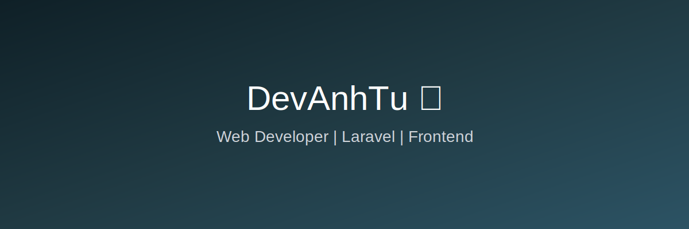

<!-- DevAnhTu -->

<h2 align="center">👋 Hi Aliens! I'm DevAnhTu from the Earth 🌍</h2>

  A passionate Web Developer who loves building real-world products 🚀

---

## 🛠 Technologies and Tools 🛠

  
  
  
  
  
  
  
  
  
  

---

## 🔥 GitHub Stats 🔥

  
  

---

## 🌐 Where to find me

  
  
  
  

---

<h3 align="center">✨ “Code. Learn. Build. Repeat.” ✨</h3>

